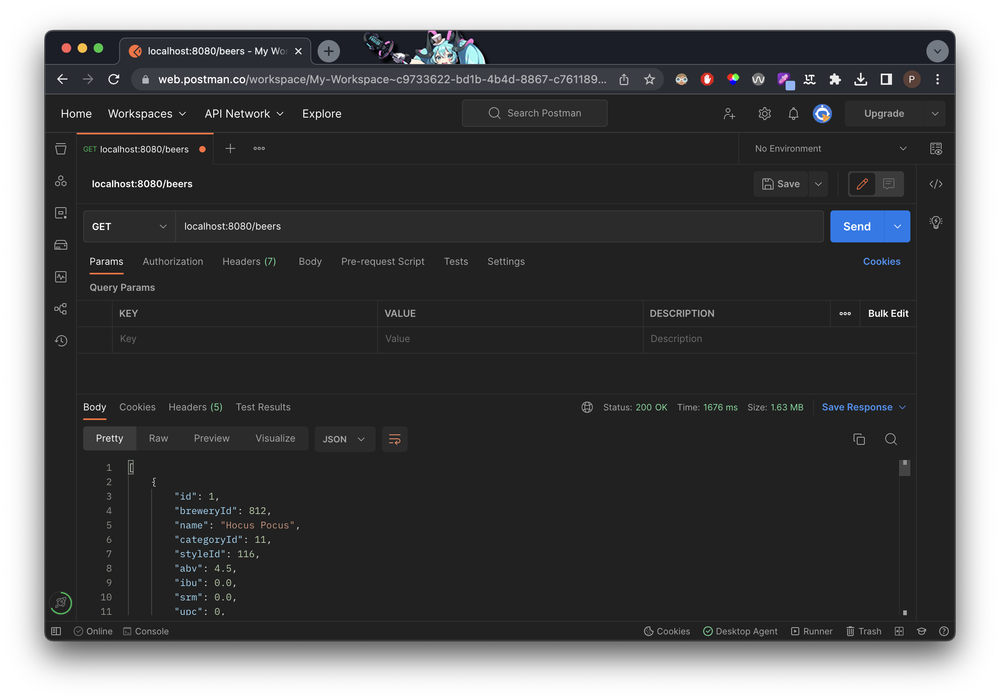
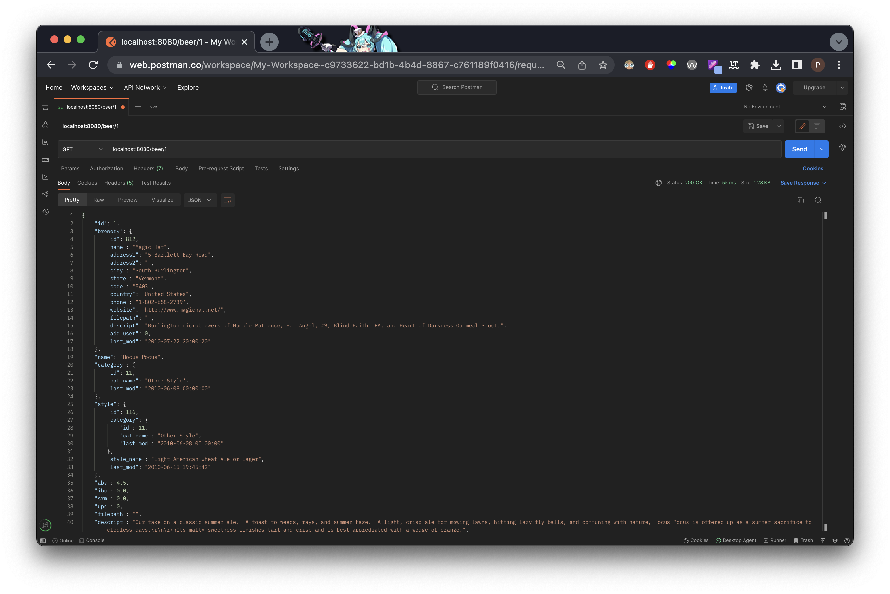
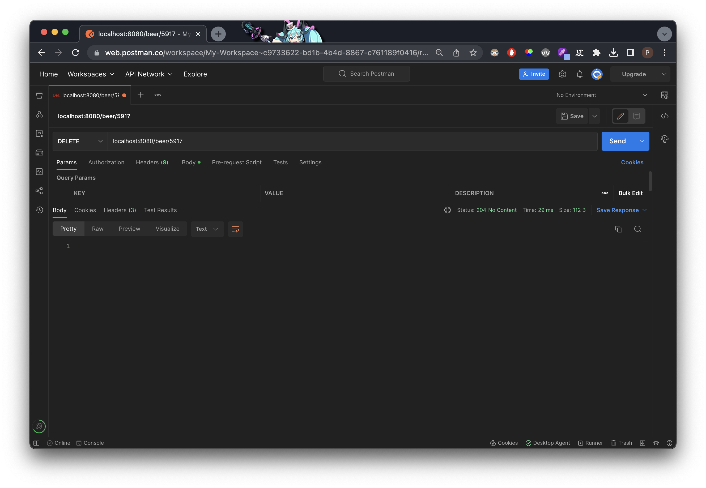
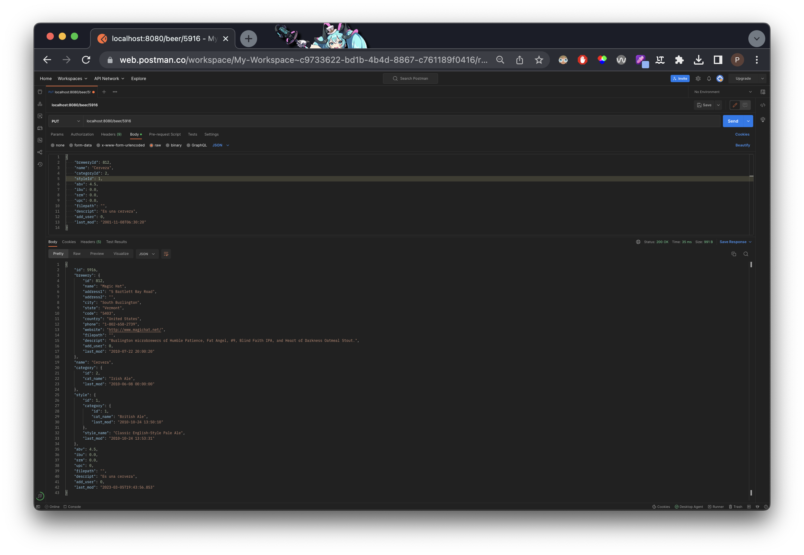
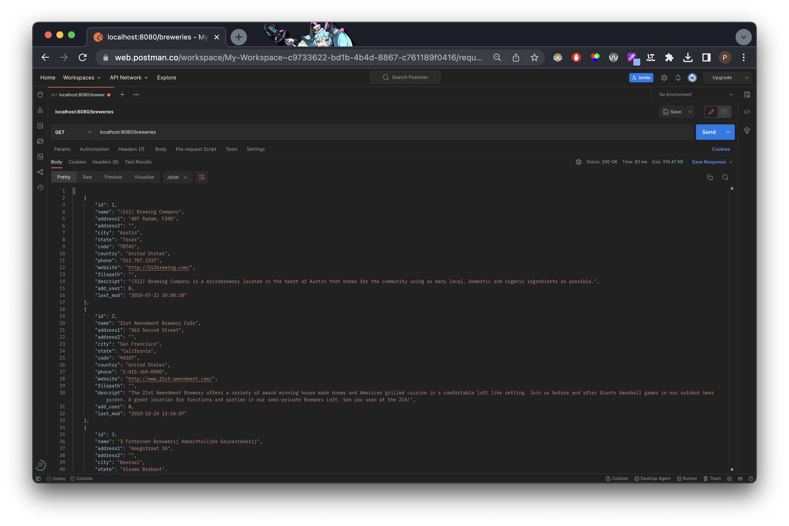
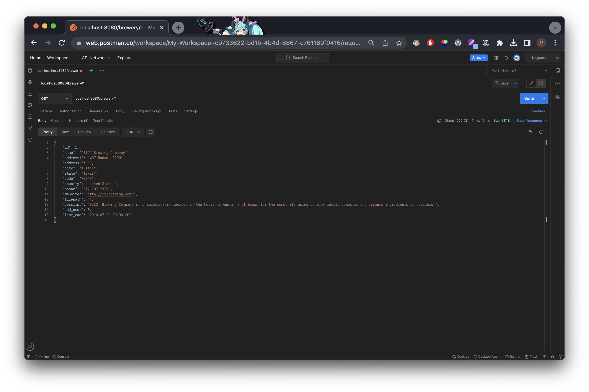
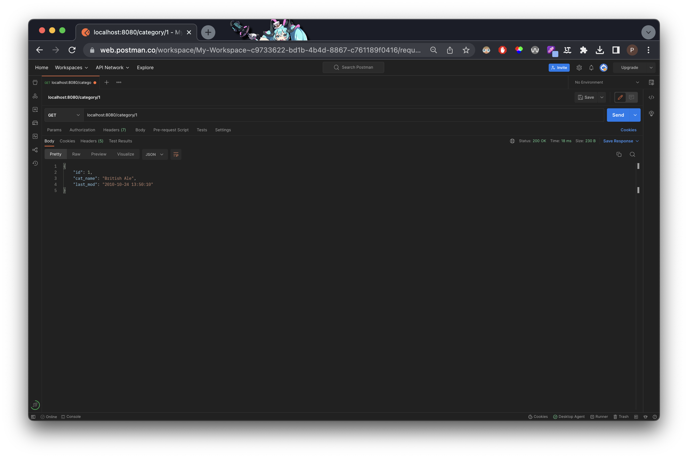
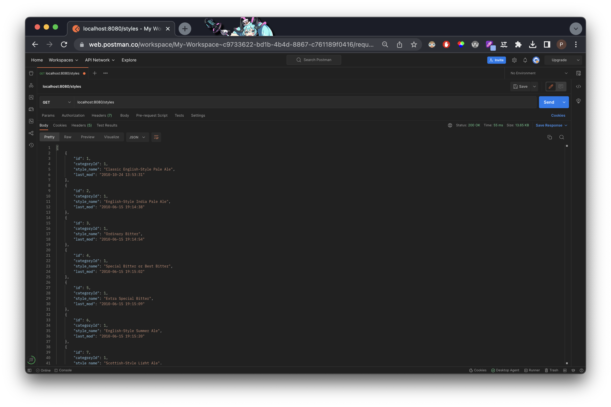
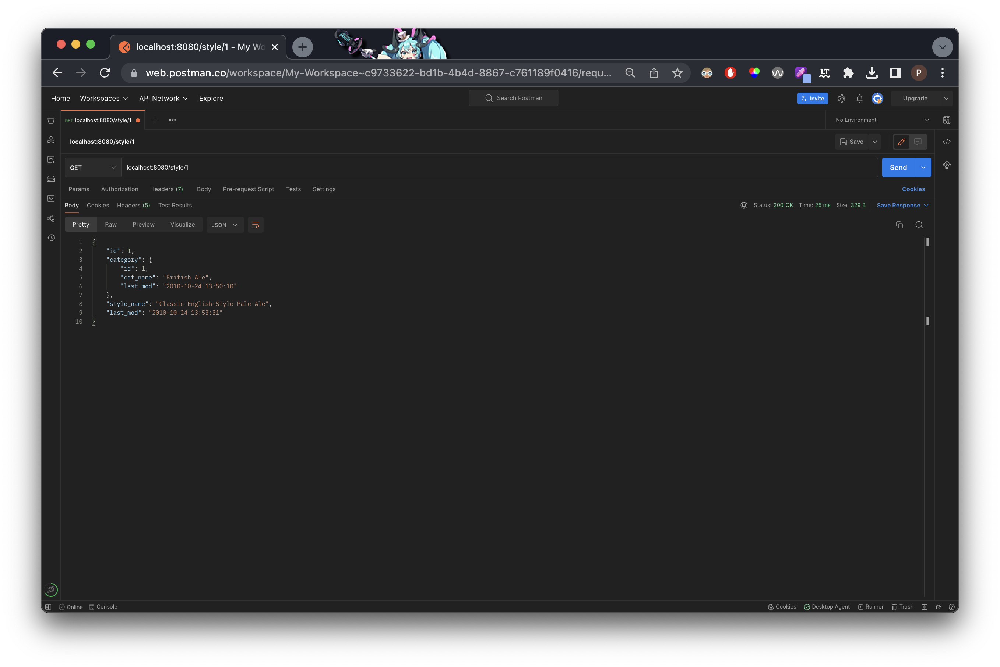

# Guía de peticiones para la kata de Cervezas

En este documento comentaremos las distintas EntryPoints que son necesarias para el uso de esta API. Hemos utilizado Postman.

- [Guía de peticiones para la kata de Cervezas](#guía-de-peticiones-para-la-kata-de-cervezas)
  - [Cervezas](#cervezas)
    - [GET /beers](#get-beers)
    - [GET /beer/{id}](#get-beerid)
    - [DELETE /beer/{id}](#delete-beerid)
    - [POST /beer/{id}](#post-beerid)
    - [PUT /beer/{id}](#put-beerid)
  - [Cervecerías](#cervecerías)
    - [GET /breweries](#get-breweries)
    - [GET /brewery/{id}](#get-breweryid)
  - [Categorías](#categorías)
    - [GET /categories](#get-categories)
    - [GET /category/{id}](#get-categoryid)
  - [Estilos](#estilos)
    - [GET /styles](#get-styles)
    - [GET /style/{id}](#get-styleid)

## Cervezas

### GET /beers

Para sacar todas las cervezas -> GET <http://localhost:8080/beers>

### GET /beer/{id}

Para obtener una cerveza en concreto y toda la información relacionada a esta -> GET <http://localhost:8080/beer/{id>}

### DELETE /beer/{id}

Para borrar una cerveza en concreto -> DELETE <http://localhost:8080/beer/{id>}

### POST /beer/{id}

Para la creación de una nueva cerveza -> POST <http://localhost/beer>

Tenemos que pasarle los campos que se encuentran en el DTO.

### PUT /beer/{id}

Para modificar una cerveza en concreto -> PUT <http://localhost:8080/beer/{id>}
Al igual que para la creación, tenemos que pasarle los campos del DTO.

## Cervecerías

### GET /breweries

Para obtener todas las cervecerías -> GET <http://localhost:8080/breweries>

### GET /brewery/{id}

Para obtener una cervecería en concreto, así como su información relativa -> GET <http://localhost:8080/brewery/{id>}

## Categorías

### GET /categories

Para obtener todas las categorias -> GET <http://localhost:8080/categories>

### GET /category/{id}

Para obtener una categoría en concreto, así como toda la información relativa a esta -> GET <http://localhot:8080/category/{id>}

## Estilos

### GET /styles

Para obtener todos los estilos -> GET <http://localhost:8080/styles>

### GET /style/{id}

Para obtener un estilo en concreto, así como su información -> GET <http://localhost:8080/style/{id>}

